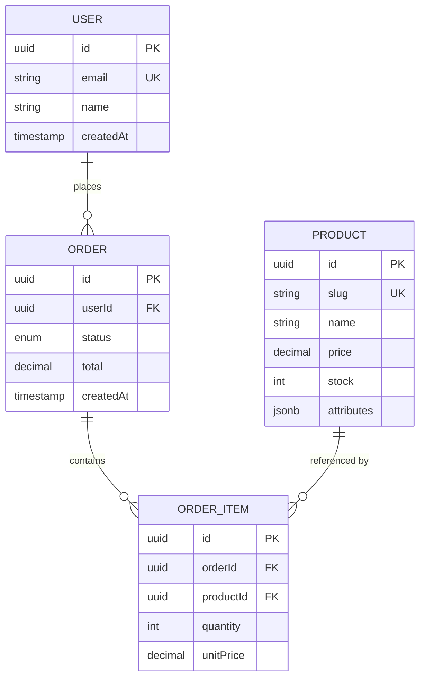

# E-commerce Learning Guide: NestJS + GraphQL + PostgreSQL

A simplified, learning-focused guide for building an e-commerce backend with modern best practices.

---

## 🎯 Learning Goals

- Build a production-ready database schema
- Learn NestJS with GraphQL
- Understand TypeORM patterns
- Master PostgreSQL features

---

## 📊 Database Schema (Simplified)

### Core Entities

#### **User**
```typescript
@Entity()
export class User {
  @PrimaryGeneratedColumn('uuid')
  id: string;

  @Column()
  name: string;

  @Column({ unique: true })
  email: string;
  

  @CreateDateColumn()
  createdAt: Date;

  @UpdateDateColumn()
  updatedAt: Date;

  @DeleteDateColumn()
  deletedAt?: Date; // Soft delete
}
```

**Why these fields?**
- `uuid`: Better than auto-increment for distributed systems
- `email`: Unique for login
- `passwordHash`: Never store plain passwords!
- Timestamps: Track creation/updates automatically
- `deletedAt`: Soft delete (can recover data)

---

#### **Product**
```typescript
@Entity()
export class Product {
  @PrimaryGeneratedColumn('uuid')
  id: string;

  @Column()
  name: string;

  @Column({ unique: true })
  slug: string; // URL-friendly: "gaming-laptop"

  @Column('text')
  description: string;

  @Column('decimal', { precision: 10, scale: 2 })
  price: number;

  @Column('int', { default: 0 })
  stock: number;

  @Column('jsonb', { nullable: true })
  attributes?: object; // Flexible: { color: "red", size: "L" }

  @CreateDateColumn()
  createdAt: Date;

  @UpdateDateColumn()
  updatedAt: Date;

  @DeleteDateColumn()
  deletedAt?: Date;
}
```

**Why JSONB?**
- Store flexible product attributes without extra tables
- Fast queries with GIN indexes
- Perfect for varied product specs

---

#### **Order**
```typescript
@Entity()
export class Order {
  @PrimaryGeneratedColumn('uuid')
  id: string;

  @ManyToOne(() => User)
  user: User;

  @Column('uuid')
  userId: string;

  @Column({
    type: 'enum',
    enum: ['pending', 'paid', 'shipped', 'cancelled'],
    default: 'pending'
  })
  status: string;

  @Column('decimal', { precision: 10, scale: 2 })
  total: number;

  @OneToMany(() => OrderItem, item => item.order, {
    cascade: true // Cascade insert/update
  })
  items: OrderItem[];

  @CreateDateColumn()
  createdAt: Date;

  @UpdateDateColumn()
  updatedAt: Date;
}
```

**Cascade Options:**
- `cascade: true` - All operations (insert, update, remove)
- `cascade: ['insert', 'update']` - Only specific operations
- Without cascade - Must save items separately

---

#### **OrderItem**
```typescript
@Entity()
export class OrderItem {
  @PrimaryGeneratedColumn('uuid')
  id: string;

  @ManyToOne(() => Order, order => order.items, {
    onDelete: 'CASCADE' // Delete items when order is deleted
  })
  order: Order;

  @Column('uuid')
  orderId: string;

  @ManyToOne(() => Product, {
    onDelete: 'RESTRICT' // Prevent deleting products with orders
  })
  product: Product;

  @Column('uuid')
  productId: string;

  @Column('int')
  quantity: number;

  @Column('decimal', { precision: 10, scale: 2 })
  unitPrice: number; // Price snapshot at order time
}
```

**onDelete Options:**
- `CASCADE` - Delete child when parent deleted
- `RESTRICT` - Prevent deletion if child exists
- `SET NULL` - Set FK to null when parent deleted
- `NO ACTION` - Database default behavior

---

## 🔗 Relationships Diagram



---

## 🚀 Essential Indexes

Add these for performance:

```sql
-- User lookups
CREATE INDEX idx_user_email ON "user"(email);

-- Product search
CREATE INDEX idx_product_name ON product(name);
CREATE INDEX idx_product_slug ON product(slug);

-- For ILIKE searches (fuzzy search)
CREATE EXTENSION IF NOT EXISTS pg_trgm;
CREATE INDEX idx_product_name_trgm ON product USING gin(name gin_trgm_ops);

-- JSONB queries
CREATE INDEX idx_product_attributes ON product USING gin(attributes);

-- Order queries
CREATE INDEX idx_order_user ON "order"(user_id);
CREATE INDEX idx_order_status ON "order"(status);
CREATE INDEX idx_orderitem_order ON order_item(order_id);
```

---

## 📝 GraphQL Schema Example

```graphql
type User {
  id: ID!
  name: String!
  email: String!
  orders: [Order!]!
  createdAt: DateTime!
}

type Product {
  id: ID!
  name: String!
  slug: String!
  description: String!
  price: Float!
  stock: Int!
  attributes: JSON
  createdAt: DateTime!
}

type Order {
  id: ID!
  user: User!
  items: [OrderItem!]!
  status: OrderStatus!
  total: Float!
  createdAt: DateTime!
}

type OrderItem {
  id: ID!
  product: Product!
  quantity: Int!
  unitPrice: Float!
}

enum OrderStatus {
  PENDING
  PAID
  SHIPPED
  CANCELLED
}

type Query {
  # Get single entities
  user(id: ID!): User
  product(id: ID!): Product
  order(id: ID!): Order
  
  # List with pagination
  products(limit: Int = 20, offset: Int = 0): [Product!]!
  searchProducts(query: String!): [Product!]!
  myOrders: [Order!]!
}

type Mutation {
  # User management
  register(name: String!, email: String!, password: String!): User!
  
  # Product management
  createProduct(input: CreateProductInput!): Product!
  updateProduct(id: ID!, input: UpdateProductInput!): Product!
  deleteProduct(id: ID!): Boolean!
  
  # Order management
  createOrder(items: [OrderItemInput!]!): Order!
  updateOrderStatus(id: ID!, status: OrderStatus!): Order!
}

input CreateProductInput {
  name: String!
  slug: String!
  description: String!
  price: Float!
  stock: Int!
  attributes: JSON
}

input OrderItemInput {
  productId: ID!
  quantity: Int!
}
```

---

## 🛡️ Key Best Practices

### 1. **Cascade Operations in Action**

#### Example 1: Create Order with Items (using cascade)
```typescript
// WITH cascade: true on Order.items
async createOrderWithCascade(userId: string, items: OrderItemInput[]) {
  const order = this.orderRepo.create({
    userId,
    status: 'pending',
    items: items.map(item => ({
      productId: item.productId,
      quantity: item.quantity,
      unitPrice: 10.99 // Would get from product
    }))
  });

  // Saves order AND all items automatically!
  await this.orderRepo.save(order);
  return order;
}

// WITHOUT cascade - must save separately
async createOrderWithoutCascade(userId: string, items: OrderItemInput[]) {
  const order = this.orderRepo.create({ userId, status: 'pending' });
  await this.orderRepo.save(order);

  // Must save each item manually
  for (const item of items) {
    const orderItem = this.orderItemRepo.create({
      orderId: order.id,
      productId: item.productId,
      quantity: item.quantity,
      unitPrice: 10.99
    });
    await this.orderItemRepo.save(orderItem);
  }

  return order;
}
```

#### Example 2: Delete Behavior (onDelete)
```typescript
// CASCADE: Delete order -> automatically deletes all order items
await orderRepo.delete(orderId);
// OrderItems with orderId are automatically removed

// RESTRICT: Try to delete product that has orders
await productRepo.delete(productId);
// ❌ Error: Cannot delete Product because OrderItems reference it

// Solution: Use soft delete for products
await productRepo.softDelete(productId);
// ✅ Works: Sets deletedAt, keeps data for order history
```

#### Example 3: Update with Cascade
```typescript
// Update order and add new items
const order = await orderRepo.findOne({
  where: { id: orderId },
  relations: ['items']
});

// Add new item to existing order
order.items.push(
  this.orderItemRepo.create({
    productId: newProductId,
    quantity: 2,
    unitPrice: 15.99
  })
);

// Saves new items automatically (cascade)
await orderRepo.save(order);
```

#### ⚠️ Cascade Warnings

**When to use CASCADE:**
- ✅ Parent-child with no independent life (Order → OrderItem)
- ✅ Composition relationships (Blog → Comments)

**When NOT to use CASCADE:**
- ❌ Independent entities (Product ← OrderItem)
- ❌ Shared references (Tag ← Post)
- ❌ Audit trails (use soft delete instead)

**Best Practice:**
```typescript
// Safe cascade pattern
@OneToMany(() => OrderItem, item => item.order, {
  cascade: ['insert', 'update'], // Not 'remove'!
  orphanedRowAction: 'delete'    // Clean up orphans
})
items: OrderItem[];

// Remove items manually for explicit control
async removeOrderItem(itemId: string) {
  // Explicit deletion is clearer and safer
  await this.orderItemRepo.delete(itemId);
}
```

### 2. **Use DTOs for Validation**
```typescript
import { InputType, Field } from '@nestjs/graphql';
import { IsEmail, MinLength, IsPositive } from 'class-validator';

@InputType()
export class CreateProductInput {
  @Field()
  @MinLength(3)
  name: string;

  @Field()
  @IsPositive()
  price: number;

  @Field()
  @IsPositive()
  stock: number;
}
```

### 3. **Use Transactions for Multi-Step Operations**
```typescript
async createOrder(userId: string, items: OrderItemInput[]) {
  return this.dataSource.transaction(async (manager) => {
    // 1. Create order
    const order = manager.create(Order, { userId });
    await manager.save(order);

    // 2. Create order items & update stock
    for (const item of items) {
      const product = await manager.findOne(Product, { 
        where: { id: item.productId } 
      });
      
      if (product.stock < item.quantity) {
        throw new Error('Insufficient stock');
      }

      // Decrement stock
      product.stock -= item.quantity;
      await manager.save(product);

      // Create order item
      const orderItem = manager.create(OrderItem, {
        orderId: order.id,
        productId: item.productId,
        quantity: item.quantity,
        unitPrice: product.price
      });
      await manager.save(orderItem);
    }

    return order;
  });
}
```

### 4. **Soft Delete Pattern**
```typescript
// TypeORM handles this automatically with @DeleteDateColumn()
await productRepo.softDelete(id); // Sets deletedAt
await productRepo.restore(id);     // Clears deletedAt

// Queries automatically filter soft-deleted
const products = await productRepo.find(); // Excludes deleted

// To include deleted
const all = await productRepo.find({ withDeleted: true });
```

### 5. **Password Security**
```typescript
import * as bcrypt from 'bcrypt';

// Hash on creation
const passwordHash = await bcrypt.hash(password, 10);

// Verify on login
const isValid = await bcrypt.compare(password, user.passwordHash);
```

---

## 📚 Learning Path

### Week 1: Setup & Basics
- [ ] Setup NestJS project with GraphQL
- [ ] Configure TypeORM + PostgreSQL
- [ ] Create User entity
- [ ] Implement register/login

### Week 2: Product Management
- [ ] Create Product entity
- [ ] CRUD operations via GraphQL
- [ ] Add search with ILIKE
- [ ] Test JSONB attributes

### Week 3: Orders
- [ ] Create Order & OrderItem entities
- [ ] Implement createOrder mutation
- [ ] Add stock validation
- [ ] Use transactions

### Week 4: Polish
- [ ] Add indexes
- [ ] Implement pagination
- [ ] Add error handling
- [ ] Write tests

---

## 🔍 Common Queries Examples

### Search products
```typescript
const products = await productRepo
  .createQueryBuilder('product')
  .where('product.name ILIKE :query', { query: `%${searchTerm}%` })
  .andWhere('product.deletedAt IS NULL')
  .limit(20)
  .getMany();
```

### Query JSONB attributes
```typescript
const redProducts = await productRepo
  .createQueryBuilder('product')
  .where("product.attributes->>'color' = :color", { color: 'red' })
  .getMany();
```

### Get user orders with items
```typescript
const orders = await orderRepo.find({
  where: { userId },
  relations: ['items', 'items.product'],
  order: { createdAt: 'DESC' }
});
```

---

## 🎓 Key Takeaways

1. **UUIDs** > Auto-increment for scalability
2. **Soft deletes** preserve data and enable recovery
3. **Timestamps** track when things happen
4. **JSONB** adds flexibility without schema changes
5. **Indexes** make queries fast
6. **Transactions** keep data consistent
7. **DTOs** validate input automatically

---

## 📖 Next Steps

- Add authentication (JWT)
- Implement pagination (cursor-based)
- Add file uploads for product images
- Set up testing (Jest)
- Deploy to production

---

**Happy Learning! 🚀**
